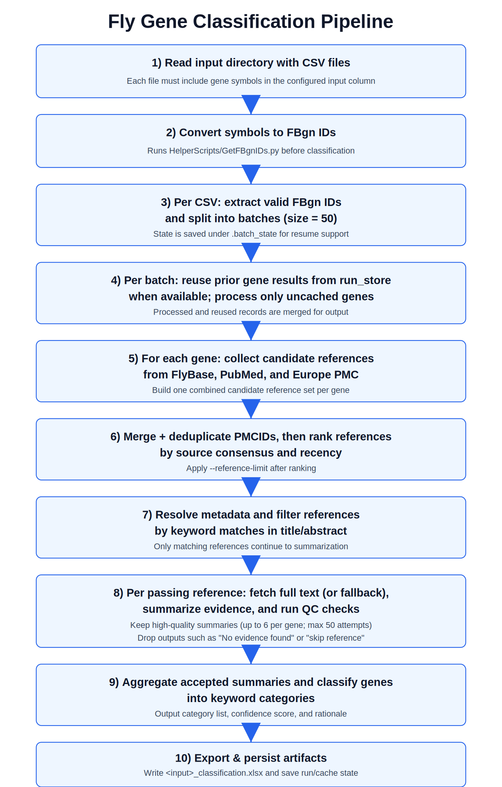

# fl.AI Gene Classification + Reagent Finder

Standalone Drosophila pipeline that reads gene sets from CSV files, converts input symbols to FlyBase IDs, gathers and summarizes literature evidence, classifies genes against user-supplied keywords, and extracts paper-supported reagent hits for each target gene.

The recent reagent-finder extension does not replace classification. It runs alongside the existing literature pipeline and exports normalized reagent records from the same supporting papers used for evidence review.

## Pipeline Flowchart



## What The Pipeline Does

- Reads every input CSV in a directory.
- Pulls gene symbols from a configurable input column via `--input-gene-col` (default: `ext_gene`).
- Converts symbols to FlyBase `FBgn` identifiers using the bundled helper script.
- Validates genes and loads FlyBase synonym and publication mappings.
- Collects candidate references from FlyBase, PubMed, and Europe PMC.
- Merges and ranks references by cross-source support and publication recency.
- Filters references using your keyword list against title and abstract metadata.
- Retrieves full text when possible and summarizes gene-specific function and phenotype evidence.
- Extracts reagent mentions tied to the target gene from paper text.
- Deduplicates reagent records into canonical `(stock_id, collection)` pairs.
- Aggregates evidence into per-gene classifications and exports one Excel workbook per input CSV.

## Reagent Finder Scope

The reagent-finder logic is paper-aware and gene-aware:

- It only extracts reagents when they are associated with the target gene being processed.
- It keeps only records where both `stock_id` and `collection` can be identified.
- It normalizes common stock-center names, including `BDSC`, `VDRC`, `NIG`, and `Kyoto`.
- It merges duplicate reagent mentions across text chunks from the same paper.
- It exports both a compact reagent-pair view and a detailed per-reagent table.

## Example End-To-End Flow

Assume one gene (`gene X`, `FBgn0009999`) and keywords `sleep,circadian,synapse`.

1. Reference collection gathers candidate papers from FlyBase, PubMed, and Europe PMC.
2. Merge and ranking collapse duplicates and prioritize papers seen in multiple sources.
3. Keyword filtering removes papers with no relevant keyword evidence in title or abstract.
4. Full-text retrieval and summarization produce gene-specific function and phenotype summaries.
5. Reagent extraction scans the same paper text for stock IDs and collections relevant to `gene X`.
6. Aggregation produces a final classification plus detailed paper-level and reagent-level exports.

## Requirements

- Python 3.10+ recommended
- Dependencies in `requirements.txt`
- Environment variables:
  - `OPENAI_API_KEY` required for summarization, classification, and reagent extraction
  - `OPENAI_MODEL` optional, defaults to `gpt-5.4`
  - `NCBI_API_KEY` optional, improves NCBI throughput
  - `UNPAYWALL_TOKEN` optional for full-text retrieval fallback

## Data Dependencies

This script expects access to shared project data on the lab storage mount:

- macOS: `/Volumes/umms-rallada`
- ARC/HPC Linux: `/nfs/turbo/umms-rallada`

It uses shared FlyBase reference files and shared PubMed/full-text caches under that mount.

## Install

```bash
python -m venv .venv
source .venv/bin/activate
pip install -r requirements.txt
```

## Run

```bash
python flai-gene-classification.py /path/to/input_dir \
  --keywords "sleep,circadian,synapse" \
  --reference-limit 500 \
  --input-gene-col ext_gene
```

Useful options:

- `--keywords`, `-k`: comma-separated categories or concepts used for evidence filtering and final classification
- `--reference-limit`, `-r`: maximum references to consider per gene
- `--input-gene-col`: input gene symbol column in each CSV, default `ext_gene`
- `--force-all`: ignore checkpoint state and recompute all genes from scratch

## Input Expectations

- The input path should be a directory containing one or more CSV files.
- Each CSV is treated as an independent gene set.
- The gene symbol column defaults to `ext_gene`, but can be changed with `--input-gene-col`.
- Output workbooks are written next to each input file as `<input_name>_classification.xlsx`.

## Excel Outputs

Each workbook contains four sheets:

- `Gene Set`: original input rows for the gene set
- `Classification`: one row per validated gene with category, confidence, rationale, and supporting/full-text reference counts
- `Reference Summaries`: one row per retained paper with metadata, abstract, gene-specific summary, source, classification, and `Reagent_Pairs`
- `Reagents`: one row per extracted reagent with `Stock_ID`, `Collection`, `Reagent_Type`, `Functional_Validity`, `Evidence_Snippet`, `Reagent_Name`, and source metadata

## Notes

- Reagent extraction is evidence-driven, not a standalone stock database lookup.
- If no high-quality evidence is found for a paper, it will not produce reagent hits for that reference.
- `--force-all` is helpful when re-running a directory after changing prompts, logic, or keyword sets.

